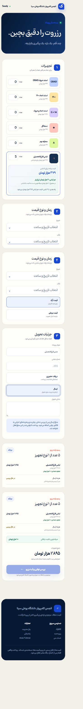
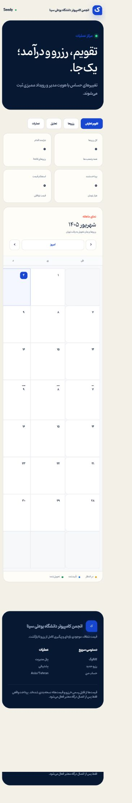
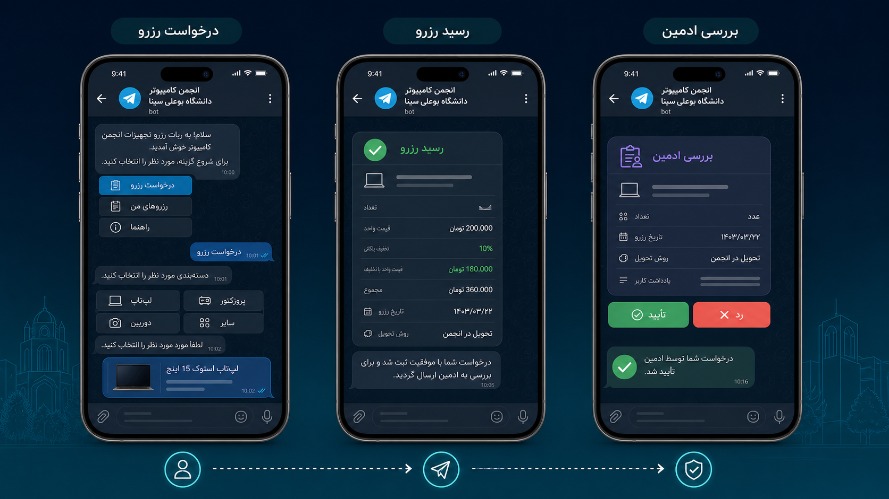
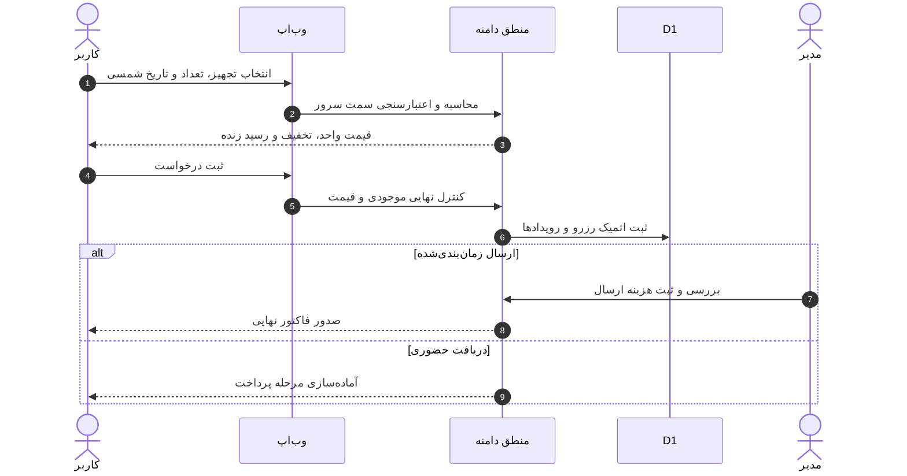
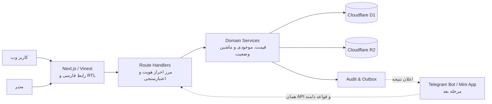

<div align="center">


# سامانه رزرو تجهیزات انجمن کامپیوتر دانشگاه بوعلی سینا

سامانه‌ای فارسی، راست‌به‌چپ و واکنش‌گرا برای رزرو تجهیزات، محاسبه شفاف قیمت، مدیریت تحویل و پیگیری کامل درخواست‌ها.

[](https://www.typescriptlang.org/)
[](https://nextjs.org/)
[](https://www.cloudflare.com/)
[](#نمای-محصول)
[](#کنترل-کیفیت)

[نسخه آنلاین](https://basu-rental.welinkupgroup.chatgpt.site) · [برنامه اجرایی بات تلگرام](docs/telegram-bot-rollout-plan.md) · [معماری سیستم](docs/architecture/system-architecture.md) · [راهنمای عملیات](docs/operations/runbook.md)

</div>

> [!NOTE]
> نسخه آنلاین در حال حاضر خصوصی است و فقط کاربران مجاز به آن دسترسی دارند. اتصال بات تلگرام و درگاه پرداخت واقعی هنوز فعال نشده‌اند؛ مستندات و تصویر بات در این README، طرح اجرایی مرحله بعد هستند.

<div dir="rtl">

## نمای محصول

### رزرو با قیمت پلکانی و رسید زنده

در نمونه زیر تعداد لباس فارغ‌التحصیلی روی ۵ تنظیم شده است. سامانه قیمت هر لباس، میزان صرفه‌جویی، جمع تجهیزات و وضعیت «در حال بررسی» هزینه ارسال را همان لحظه به کاربر نشان می‌دهد.

<p align="center">
  
</p>

### پنل مدیریت و تقویم شمسی

داشبورد مدیر وضعیت رزروها، پرداخت‌ها و عملیات را همراه با تقویم جلالی و منطقه زمانی تهران نمایش می‌دهد.

<p align="center">
  
</p>

### طرح مفهومی بات تلگرام

مسیر هدف بات: ثبت درخواست توسط کاربر، صدور رسید، ارسال درخواست برای مدیر، تصمیم مدیر و اعلام نتیجه به همان کاربر است. جزئیات فنی، امنیتی و عملیاتی این مسیر در [برنامه اجرایی بات تلگرام](docs/telegram-bot-rollout-plan.md) آمده است.

<p align="center">
  
</p>

> این تصویر یک موکاپ مفهومی است و اسکرین‌شات قابلیت فعال تلگرام نیست. [پرامپت تولید تصویر](docs/assets/readme/telegram-bot-concept.prompt.md) نیز برای بازتولیدپذیری نگهداری شده است.

## قابلیت‌های اصلی

| حوزه | قابلیت | وضعیت |
| --- | --- | :---: |
| تجربه کاربر | رابط کاملاً فارسی و RTL با فونت یکپارچه Pinar | ✅ |
| رزرو | انتخاب چند تجهیز، تعداد، بازه زمانی و روش تحویل | ✅ |
| قیمت‌گذاری | پلکان قیمت لباس بر اساس تعداد و نمایش قیمت واحد | ✅ |
| فاکتور | رسید زنده شامل ریز اقلام، تخفیف تعدادی و جمع تجهیزات | ✅ |
| ارسال | توقف جمع نهایی تا بررسی و ثبت هزینه ارسال توسط مدیر | ✅ |
| تاریخ | انتخابگر و تقویم شمسی با زمان‌بندی `Asia/Tehran` | ✅ |
| مدیریت | داشبورد عملیات، تقویم رزرو و تغییر وضعیت کنترل‌شده | ✅ |
| داده | Cloudflare D1 برای داده ساخت‌یافته و R2 برای فایل‌ها | ✅ |
| امنیت | کنترل مالکیت و نقش در سرور، اعتبارسنجی ورودی و ثبت رویداد | ✅ |
| پرداخت | آداپتر آزمایشی؛ درگاه واقعی به‌صورت fail-closed غیرفعال است | 🧪 |
| تلگرام | سناریو، معماری و برنامه انتشار آماده؛ پیاده‌سازی هنوز شروع نشده | 🧭 |

## جریان رزرو



## معماری



اصل معماری پروژه این است که مرورگر یا بات فقط رابط باشند؛ قیمت، موجودی، مجوزها و تغییر وضعیت همیشه در سرور دوباره بررسی می‌شوند. بنابراین مسیر تلگرام قرار نیست منطق موازی یا دیتابیس جداگانه‌ای بسازد.

## فناوری‌ها

- Next.js 16، React 19، TypeScript 5.9 و Vinext/Vite
- Tailwind CSS 4 و فونت محلی Pinar
- Cloudflare Workers، D1 و R2
- Drizzle ORM و مهاجرت‌های SQL نسخه‌بندی‌شده
- تست‌های Node/TSX برای قیمت‌گذاری، تقویم جلالی، امنیت و فاکتور ارسال

## اجرای محلی

### پیش‌نیازها

- Node.js نسخه `22.13.0` یا جدیدتر
- pnpm

```bash
git clone https://github.com/sedwna/basu-rental.git
cd basu-rental
pnpm install --frozen-lockfile
pnpm dev
```

برنامه به‌صورت پیش‌فرض روی `http://localhost:3000` اجرا می‌شود. محیط توسعه Sites ورود آزمایشی را فراهم می‌کند و آدرس پنل مدیریت `/admin` است.

## فرمان‌های توسعه

| فرمان | کاربرد |
| --- | --- |
| `pnpm dev` | اجرای محیط توسعه |
| `pnpm typecheck` | بررسی نوع‌های TypeScript |
| `pnpm lint` | اجرای ESLint |
| `pnpm test` | اجرای تست‌های خودکار |
| `pnpm build` | ساخت نسخه production |
| `pnpm check` | اجرای همه دروازه‌های کیفیت |
| `pnpm db:generate` | تولید migrationهای Drizzle |

## ساختار پروژه

```text
app/
├── account/                 # حساب کاربر و جزئیات رزرو
├── admin/                   # داشبورد مدیر و تقویم شمسی
├── api/                     # مرز HTTP، فایل و تقویم
├── book/                    # سازنده رزرو و رسید زنده
├── components/              # اجزای مشترک رابط
├── equipment/               # کاتالوگ و جزئیات تجهیزات
└── lib/                     # دامنه، قیمت، امنیت، دیتابیس و تاریخ جلالی
db/                          # پیکربندی Drizzle/D1
drizzle/                     # migrationهای نسخه‌بندی‌شده
docs/                        # معماری، امنیت، عملیات و برنامه تلگرام
public/                      # دارایی‌های عمومی
tests/                       # تست‌های خودکار
```

## مدل قیمت‌گذاری لباس

قیمت لباس فارغ‌التحصیلی از یک جدول پلکانی قطعی محاسبه می‌شود. با تغییر تعداد، قیمت هر واحد و صرفه‌جویی کل در رابط به‌روز می‌شود؛ هنگام ثبت نیز همین محاسبه در سرور تکرار می‌شود و نتیجه داخل خط رزرو snapshot خواهد شد. این طراحی از اختلاف میان مبلغ نمایش‌داده‌شده و مبلغ ثبت‌شده جلوگیری می‌کند.

## هزینه ارسال

برای روش «ارسال»، مبلغ نهایی تا زمانی که مدیر نشانی، زمان‌بندی و هزینه اجرایی را بررسی نکرده باشد صادر نمی‌شود. هزینه تأییدشده سپس به فاکتور افزوده می‌شود؛ برای «دریافت حضوری» جمع تجهیزات مستقیماً مبنای ادامه فرایند است. جزئیات در [سیاست هزینه ارسال](docs/operations/delivery-fees.md) ثبت شده است.

## مسیر توسعه بات تلگرام

بات پیشنهادی از webhook امن و Telegram Mini App استفاده می‌کند و به همان API، دیتابیس و قواعد دامنه وب متصل می‌شود. برنامه شامل احراز `initData`، جلوگیری از پردازش تکراری updateها، پیام تصمیم مدیر با دکمه‌های یک‌بارمصرف، ثبت هزینه ارسال، اعلان نتیجه، مانیتورینگ و سناریوی rollback است.

برای اجرای صفر تا صد به [برنامه اجرایی بات تلگرام](docs/telegram-bot-rollout-plan.md) مراجعه کنید.

## کنترل کیفیت

دروازه کامل کیفیت:

```bash
pnpm check
```

این فرمان typecheck، lint، تست‌ها و production build را پشت سر هم اجرا می‌کند. در وضعیت فعلی ۲۰ تست خودکار پروژه پاس می‌شوند.

## امنیت و حریم خصوصی

- مجوز مدیر و مالکیت رزرو در سمت سرور کنترل می‌شود.
- موجودی و قیمت در لحظه ثبت به‌صورت اتمیک دوباره بررسی می‌شوند.
- کلیدهای R2 خصوصی و دسترسی فایل‌ها وابسته به رزرو و نقش کاربر است.
- داده حساس، لینک امضاشده، مدرک هویتی و متن آزاد کاربر وارد لاگ نمی‌شوند.
- آداپترهای پرداخت و اعلان بدون تنظیمات production موفقیت جعلی ثبت نمی‌کنند.

برای جزئیات بیشتر [بازبینی امنیت](docs/security/security-review.md) و [تصمیم‌های معماری](docs/architecture/) را ببینید.

## استقرار

پروژه برای OpenAI Sites روی Cloudflare آماده شده و bindingهای زیر را انتظار دارد:

```json
{
  "d1": "DB",
  "r2": "FILES"
}
```

استقرار production، عمومی‌کردن دسترسی، فعال‌سازی درگاه واقعی و ثبت webhook تلگرام باید به‌عنوان gateهای جداگانه و قابل بازگشت انجام شوند.

---

<p align="center">
  ساخته‌شده برای انجمن کامپیوتر دانشگاه بوعلی سینا<br />
  قیمت شفاف، موجودی بازه‌ای و پیگیری کامل از درخواست تا بازگشت
</p>

</div>
