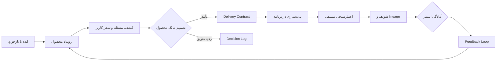

# فضای کاری Product Operations پروژه BASU Rental

این پوشه حافظه محصول، قراردادهای تصمیم‌گیری و شواهد تحویل سامانه رزرو تجهیزات انجمن کامپیوتر دانشگاه بوعلی سینا است. هدف آن این است که توسعه‌دهنده یا مدیر محصول بعدی فقط با خواندن کد، مجبور به حدس‌زدن چرایی تصمیم‌ها، محدوده محصول یا معیارهای پذیرش نباشد.

این workspace بر پایه [Open Product Operations OS](https://github.com/sedwna/open-product-operations-os) ساخته شده و از snapshot رسمی commit `b2e1473` مخزن اولیه تیم محصول، با حفظ پنج commit تاریخچه، به این monorepo منتقل شده است.

## قبل از شروع توسعه چه بخوانیم؟

این ترتیب، کوتاه‌ترین مسیر برای ساختن تصویر درست از محصول است:

1. [`product-ops.config.json`](product-ops.config.json): هویت پروژه، نقش‌ها، وضعیت‌ها، gateها و تنظیمات چرخه محصول.
2. [`events/EVT-20260823-001-event.md`](events/EVT-20260823-001-event.md): رویداد اصلی که محدوده این نسخه را آغاز کرده است.
3. [`workbook/09-decision-log.csv`](workbook/09-decision-log.csv): تصمیم‌های محصول و دلیل آن‌ها.
4. [`workbook/11-delivery-tickets.csv`](workbook/11-delivery-tickets.csv): قراردادهای تحویل تاییدشده میان محصول و توسعه.
5. [`workbook/12-validation-plans.csv`](workbook/12-validation-plans.csv) و [`workbook/13-validation-scenarios.csv`](workbook/13-validation-scenarios.csv): روش اثبات معیارهای پذیرش.
6. [`taskboard/tasks.csv`](taskboard/tasks.csv): توالی کارها، مالکیت و وضعیت اجرای چرخه.
7. [`Feedback Loop.md`](Feedback%20Loop.md): آموخته‌های ثبت‌شده حین ساخت محصول.

پس از این موارد، [README اصلی برنامه](../README.md)، [معماری فنی](../docs/architecture/system-architecture.md) و [برنامه بات تلگرام](../docs/telegram-bot-rollout-plan.md) را بخوانید.

## منابع حقیقت

| موضوع | منبع اصلی |
| --- | --- |
| تعریف پروژه، نقش‌ها و gateها | `product-ops.config.json` |
| قواعد مالکیت و ارتباط | `governance/` |
| تعریف مسئولیت عامل‌ها | `agents/registry.json` و `agents/roles/` |
| تصمیم‌ها، فرضیه‌ها و شواهد محصول | `workbook/` |
| وضعیت اجرای کار | `taskboard/tasks.csv` |
| قراردادهای handoff محصول و توسعه | `.product-ops/runtime/development/contracts/` |
| رخدادها و منشأ تغییرات | `events/` و `workbook/23-lineage.csv` |
| قرارداد ساختاری داده‌ها | `schemas/` |

فایل‌های داخل `workbook/` نمای قابل‌مرور چرخه محصول هستند. فایل‌های `.product-ops/runtime/` receipt و قرارداد ماشینی همان چرخه‌اند؛ آن‌ها را بدون جایگزین‌کردن مدرک مرجع حذف یا بازنویسی نکنید.

## معماری عملیاتی محصول

اصل حاکم این است که محصول «قصد، اولویت، محدودیت و معیار پذیرش» را تعیین می‌کند و توسعه «راه‌حل فنی و شواهد پیاده‌سازی» را. هیچ‌یک نمی‌تواند تایید انسانی یا راستی‌آزمایی مستقل متعلق به نقش دیگر را جعل کند.

## روش ادامه‌دادن یک تغییر

1. درخواست تازه را با یک شناسه یکتا به‌عنوان idea/event ثبت و منشأ آن را مشخص کنید.
2. اثر درخواست روی سفر کاربر، قیمت، موجودی، عملیات، امنیت و داده را بررسی کنید.
3. تصمیم انسانی و محدوده تاییدشده را در decision log ثبت کنید.
4. یک delivery ticket با معیارهای پذیرش قابل مشاهده، محدودیت‌ها و مرز نوشتن بسازید.
5. پیاده‌سازی را در پوشه‌های برنامه خارج از این workspace انجام دهید؛ منطق محصول را داخل فایل‌های UI پنهان نکنید.
6. تست و شواهد را به validation plan/scenario/result و evidence متصل کنید.
7. taskboard، lineage، readiness و feedback loop را پس از نتیجه واقعی به‌روزرسانی کنید.

یک تغییر تنها زمانی کامل است که کد، معیار پذیرش، شواهد و وضعیت محصول با هم سازگار باشند.

## قواعد ویرایش

- تصمیم گذشته را بی‌صدا بازنویسی نکنید؛ تصمیم جدید با دلیل و lineage تازه ثبت کنید.
- وضعیت «انجام‌شده» فقط با شاهد قابل خواندن یا نتیجه تست ثبت می‌شود.
- فرضیه، مشاهده انسانی و واقعیت production را در یک ستون یا سند مخلوط نکنید.
- داده حساس، کلید، شماره تماس، مدرک هویتی یا متن آزاد مشتری را وارد workbook و runtime نکنید.
- تغییر قیمت یا سیاست باید نسخه‌پذیر باشد و اثرش روی رزروهای قبلی مشخص شود.
- تغییر ساختار CSV/JSON باید با schema متناظر و مصرف‌کننده‌های آن هماهنگ شود.
- فایل‌های تولیدشده را فقط وقتی commit کنید که برای audit، handoff یا بازتولید تصمیم لازم باشند.

## ارتباط با کد برنامه

این پوشه برنامه قابل اجرا نیست و dependency کد production محسوب نمی‌شود. برنامه در ریشه مخزن قرار دارد و باید بدون خواندن runtime محصول در زمان اجرا build شود. ارتباط این دو لایه از طریق delivery contract، معیار پذیرش، اسناد معماری و شواهد تست برقرار می‌شود.

شیت اصلی قیمت که در workspace اولیه untracked بود عمداً به این snapshot وارد نشده است. قیمت‌های استخراج‌شده و قواعد فعلی در [`docs/data/pricing-source.md`](../docs/data/pricing-source.md)، کاتالوگ برنامه و تست‌های قیمت‌گذاری نگهداری می‌شوند.

## تاریخچه و مالکیت

تاریخچه اولیه این پوشه با Git subtree وارد شده است؛ بنابراین commitهای زیر در graph همین مخزن قابل مشاهده‌اند:

- `2135b86` — ایجاد workspace محصول
- `9a22ade` — تنظیم پروژه و ثبت ایده اولیه
- `7e66af4` — triage و تصمیم MVP
- `7bb52f9` — تایید مالک محصول برای محدوده کامل
- `b2e1473` — ثبت قراردادهای نهایی تحویل BASU

از این پس تغییرات این پوشه مانند سایر بخش‌های همین monorepo commit می‌شوند و به مخزن جداگانه‌ای نیاز ندارند.
